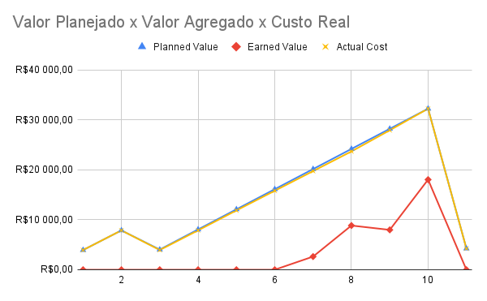
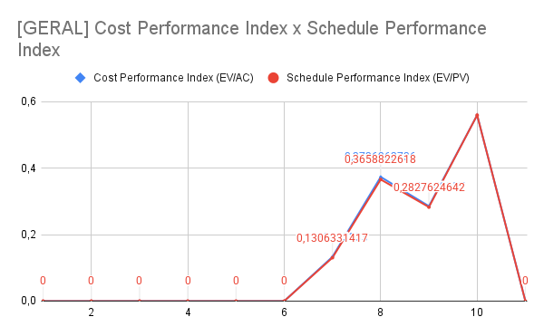

# AgileEVM (Earned Value Management)

## Versionamento

| **Versão** | **Data** | **Modificação** | **Responsável** |
| :-: | :-: | :-: | :-: |
| 0.1 | 19/12/24 | Criação do documento | Gabriel Mariano |
| 0.2 | 09/02/24 | Adição dos Gráficos | Gabriel Mariano |

*Tabela 1: Versionamento*

---

## Objetivo

Sulaiman, Barton e Blackburn (2006) apresentam o *AgileEVM* enquanto um método adaptado a partir do método *EVM* (*Earned Value Management*) que visa avaliar o *Return on Investment* (*ROI*) relacionado com a visão do produto.

Deste modo, este artefato objetiva instanciar o *AgileEVM* no contexto do atual projeto.

## EVM

Ainda segundo Sulaiman, Barton e Blackburn (2006), há a definição de termos específicos para algumas das variáveis que compõem o *AgileEVM*. Todos estes são apresentados (através de fórmulas) na [Planilha de Custos e EVM](https://docs.google.com/spreadsheets/d/1jqF0V4F1PVVlrQ0ySFKpQiEWR2LGs0UUea_tIe5XZnA/edit?usp=sharing) e melhor descritos no artigo **AgileEVM - Earned Value Management in Scrum Projects**.

Abaixo, são apresentadas a planilha com a descrição das variáveis de custo do projeto e, em aba distinta, o *AgileEVM* instanciado.

<iframe src="https://docs.google.com/spreadsheets/d/e/2PACX-1vQDhgzyWU9-_FceQ_muS4N4YleUWVUwxMXxHOVR7PEAYGTwNhlxBG6UnuNSGv9iZNiO1rsmb6z1YqLW/pubhtml?widget=true&amp;headers=false" width="900" height="700"></iframe>

## Avaliação Final

Considerando o *EVM* anteriormente disposto, foi possível obter informações relativas ao acompanhamento do projeto nos domínios do tempo, custo e escopo. Abaixo, são expostos os gráficos com a visualização de tais informações atualizado até o final da *Release MVP* (referente à *sprint* 10):

*Figura 1: Geral - Planned Value x Earned Value x Actual Cost*

 

*Figura 2: Geral - Cost Performance Index x Schedule Performance Index*

Ressalta-se que uma visualização destas e de outras informações provenientes do *EVM* se encontram na planilha anteriormente apresentada.

## Fontes

SULAIMAN, Tamara; BARTON, Brent; BLACKBURN, Thomas. **AgileEVM - Earned Value Management in Scrum Projects**. IEEE, AGILE Conference, 2006.

2024.1 - CALCULUS. **EVM**. Disponível em: <https://fga-eps-mds.github.io/2024.1-CALCULUS-DOC/organizacoes/EVM/>.

2024.1 - SENTINELA. **EVM**. Disponível em: <https://fga-eps-mds.github.io/2024.1-SENTINELA-DOC/gestao/evm/>.
